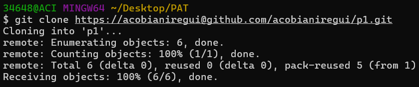
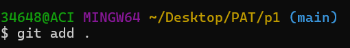
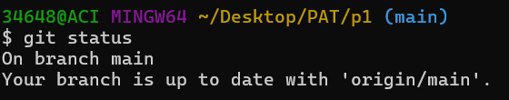
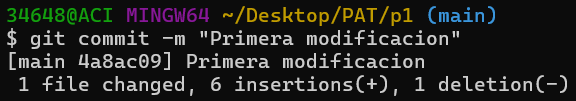
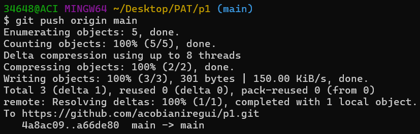
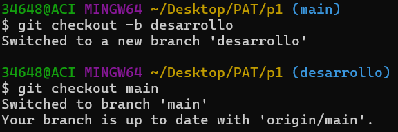
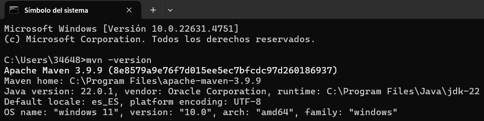
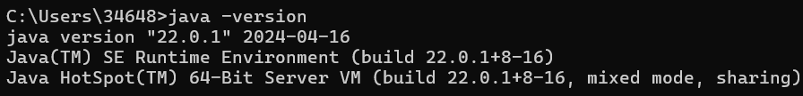
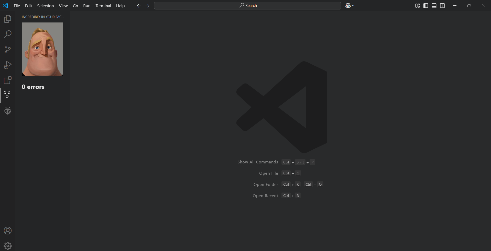
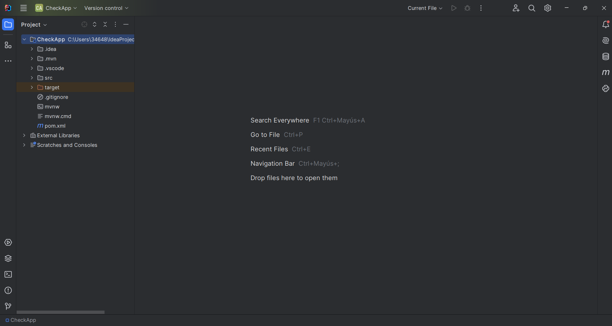

# Práctica 1 (ANTON COBIAN IREGUI)

## 🔔SOLUCION PRÁCTICA 1🔔

Se ha creado un directorio denominado "p1_sol" donde se puede encontrar la memoria del pdf. Su link es el siguiente: <br>
[Memoria de la practica 1](https://github.com/acobianiregui/p1/blob/main/p1_sol/PAT_p1_commands.pdf)<br> 
Por otro lado **este mismo readme se ha modificado** para añadir las imágenes con los logs que dejan los comandos y las pruebas de las instalación del entorno de desarrollo.

## Comandos git básicos

```
git clone https://github.com/gitt-3-pat/p1
git status
git add .
git commit -m "TU MENSAJE"
git push

git checkout -b feature/1
git checkout main
```
## Logs de los comandos
git clone:



git status:



git add:



git commit:



git push:



git checkout: 



## Pruebas del entorno de desarrollo
El pdf se encuentra en el siguiente link: [Pruebas del entorno de desarrollo](https://github.com/acobianiregui/p1/blob/main/p1_sol/PAT_p1_entorno.pdf)<br>
De todas maneras se añaden las imágenes a continuación.

JAVA:



MAVEN:



VS-CODE:



INTELLJ:

